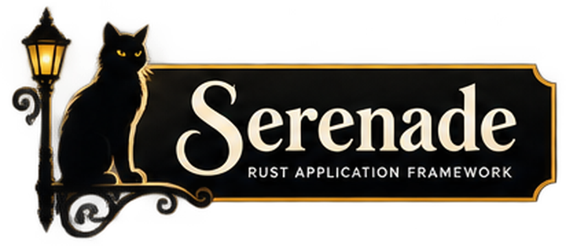

# **Serenade**

<p align="center">
  
</p>

<p align="center">
  <strong>Symfony-shaped Rust. Your app. Your stack.</strong>
</p>

Serenade is a **Symfony-oriented** application framework for Rust: kernel, DI, events, HTTP foundation, routing, config, console, Flex-like recipes, and bundles.

It is **not** Rails or Django. It does **not** force an ORM or an HTTP server. Cargo stays the package manager; Serenade owns composition.

## What you get today

| Piece | Role |
| --- | --- |
| Kernel / lifecycle | Boot, environment, bundle order, shutdown |
| DI + events | Container, tagged services, sync dispatcher |
| Config | TOML-first packages (`config/packages/*.toml`); YAML still loadable |
| Contracts | Repository / `UnitOfWork` traits (no DB driver in core) |
| HTTP + routing | Framework-agnostic request path + matcher |
| Actix adapter | `from_actix` / `to_actix` / `dispatch` + **`listen(addr, kernel)`** |
| Console | `bin/console` analogue (`serenade:about`, `debug:container`, `--interactive`) |
| Scaffolding CLI | `serenade new` / `recipe` / **`serenade tui`** (ratatui recipe picker) |
| Make aliases | `make serenade`, `make tui`, `make console`, `make ci`, … |

```text
App (domain + adapters)
  → Serenade kernel / DI / events / HTTP / console
      → your ORM choice (SQLx, SeaORM, …) implementing contracts
      → your HTTP choice (Actix today; Axum-shaped adapters welcome)
```

Business rules run in the **domain / use case before** `Repository::save`. Technical fields (`updated_at`, …) stay in the app adapter or ORM hooks. See [`docs-dev/PERSISTENCE.md`](docs-dev/PERSISTENCE.md).

## Quick start (this repo)

```bash
git clone https://github.com/Interchouette-ITC/Serenade.git
cd Serenade
make ci          # lint + test + doc (stable Rust)
make help        # all targets
```

### Scaffolding CLI

```bash
make serenade ARGS='--help'
make serenade ARGS='new demo --path /tmp'
make recipe-list
make tui ARGS='--no-cargo'          # guided recipe picker (TTY)
make serenade ARGS='recipe apply security --no-cargo'
```

Cargo remains the package manager (`cargo add` on apply unless `--no-cargo`). Details: [`docs-dev/RECIPES.md`](docs-dev/RECIPES.md).

### Demo console

```bash
make console ARGS='serenade:about'
make console ARGS='debug:container --plain'
make console ARGS='--interactive'   # rustyline REPL, ~/.serenade_history
make demo                           # sample app boot (prints routes / services)
```

Console docs: [`docs-dev/CONSOLE.md`](docs-dev/CONSOLE.md).

### Actix listen helper

```rust
use serenade_http::HttpKernel;
use serenade_http_actix::listen;

// listen("127.0.0.1:8080", kernel).await?;
```

See [`docs-dev/KERNEL.md`](docs-dev/KERNEL.md).

## Docs

| Doc | Topic |
| --- | --- |
| [`docs-dev/README.md`](docs-dev/README.md) | Developer docs index |
| [`docs-dev/VISION.md`](docs-dev/VISION.md) | Symfony analogy, non-goals |
| [`docs-dev/KERNEL.md`](docs-dev/KERNEL.md) | Components + HTTP adapters |
| [`docs-dev/CONSOLE.md`](docs-dev/CONSOLE.md) | Console Application |
| [`docs-dev/RECIPES.md`](docs-dev/RECIPES.md) | Flex-like recipes + `serenade` CLI |
| [`docs-dev/BUNDLES.md`](docs-dev/BUNDLES.md) | Bundles and extensions |
| [`docs-dev/PERSISTENCE.md`](docs-dev/PERSISTENCE.md) | Contracts, adapters, domain vs hooks |
| [`docs/CONTRIBUTING.md`](docs/CONTRIBUTING.md) | Lint bar, Make layout, PR habits |
| [`docs/brand/`](docs/brand/) | Brand assets |

## Contributing

1. Read [`docs-dev/VISION.md`](docs-dev/VISION.md).
2. Prefer Make aliases over long `cargo run -p …` lines (`make help`).
3. Gate: **`make ci`** on **stable** Rust (`rust-version` in root `Cargo.toml` is the MSRV floor).
4. One concern per PR. Commits and docs in **English**.

## Thanks

**Serenade** stands on excellent open-source projects:

| Project | Role here |
| --- | --- |
| [Rust](https://www.rust-lang.org/) | Kernel crates and contracts |
| [Tokio](https://tokio.rs/) | Async runtime for HTTP and workers |
| [clap](https://docs.rs/clap) / [cling](https://docs.rs/cling) | Scaffolding CLI |
| [ratatui](https://ratatui.rs/) | Console / recipe TUI surfaces |
| [Actix Web](https://actix.rs/) | First HTTP adapter |
| [Symfony](https://symfony.com/) (conceptual) | Architectural inspiration |

Thank you to their maintainers and communities.

## License

Apache-2.0. See [`LICENSE`](LICENSE).

<p align="center">
  
</p>
