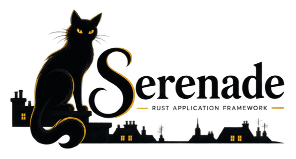

# **Serenade**

  

  <strong>Rust application framework.</strong>

Symfony-oriented application framework for Rust. **Not** Rails-style, **not** Django-style: composable kernel components and bundles around which you build products.

Serenade does **not** impose SQLx, SeaORM, Diesel, rangular, Leptos, or Actix vs Axum for your product HTTP surface. It provides architecture, contracts, and reusable components; the application chooses persistence and UI stacks.

**Primary consumer (in progress):** [RustaShop](https://github.com/Interchouette-ITC/RustaShop) - commerce kernel on Serenade, the way PrestaShop builds on Symfony.

**Status:** kernel crates on `dev` (lifecycle, DI, events, config, contracts). HTTP foundation and bundles are next.

## What we are building

| Layer        | Role                                                                                                                                           |
| ------------ | ---------------------------------------------------------------------------------------------------------------------------------------------- |
| **Serenade** | Kernel lifecycle, DI, events, HTTP foundation, routing, config, console, cache, security, messenger, serializer, validator, contracts, bundles |
| **Products** | Domain (commerce, CMS, …) composed from Serenade + chosen persistence and UIs                                                                  |

Serenade is the reusable framework repo. Applications such as RustaShop live in their own repos.

## Docs

- [`docs-dev/README.md`](docs-dev/README.md) - foundations index
- [`docs-dev/VISION.md`](docs-dev/VISION.md) - Symfony analogy, non-goals
- [`docs-dev/KERNEL.md`](docs-dev/KERNEL.md) - kernel components
- [`docs-dev/BUNDLES.md`](docs-dev/BUNDLES.md) - bundles and extension model
- [`docs-dev/PERSISTENCE.md`](docs-dev/PERSISTENCE.md) - adapter pattern and repository traits
- [`docs-dev/RUSTASHOP.md`](docs-dev/RUSTASHOP.md) - example application layout (illustrative)
- [`CONTRIBUTING.md`](CONTRIBUTING.md) - make targets, lint bar, PR habits
- Brand sizes: [`docs/brand/`](docs/brand/)

## Contributing

1. Read [`docs-dev/README.md`](docs-dev/README.md) and [`docs-dev/VISION.md`](docs-dev/VISION.md).
2. Follow [`CONTRIBUTING.md`](CONTRIBUTING.md) (`make lint`, `make test`, `make ci`).
3. Open issues for kernel or contract debates that span multiple crates.
4. Commits and docs in **English**; conventional commits when code lands.

  

## Thanks

**Serenade** stands on excellent open-source projects:

| Project                                      | Role here                          |
| -------------------------------------------- | ---------------------------------- |
| [Rust](https://www.rust-lang.org/)           | Kernel crates and contracts        |
| [Tokio](https://tokio.rs/)                   | Async runtime for HTTP and workers |
| [Serde](https://serde.rs/)                   | Config and serialization           |
| [Symfony](https://symfony.com/) (conceptual) | Architectural inspiration          |

Thank you to their maintainers and communities.

## License

Apache-2.0. See [`LICENSE`](LICENSE).

  

